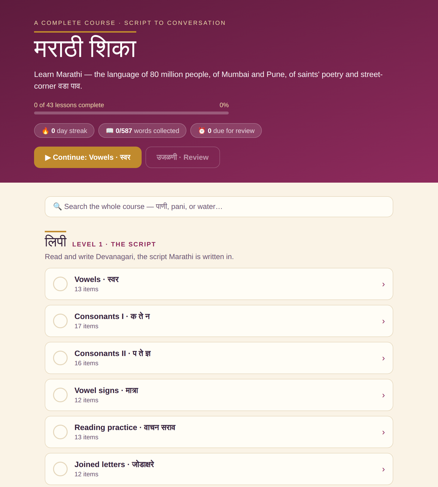
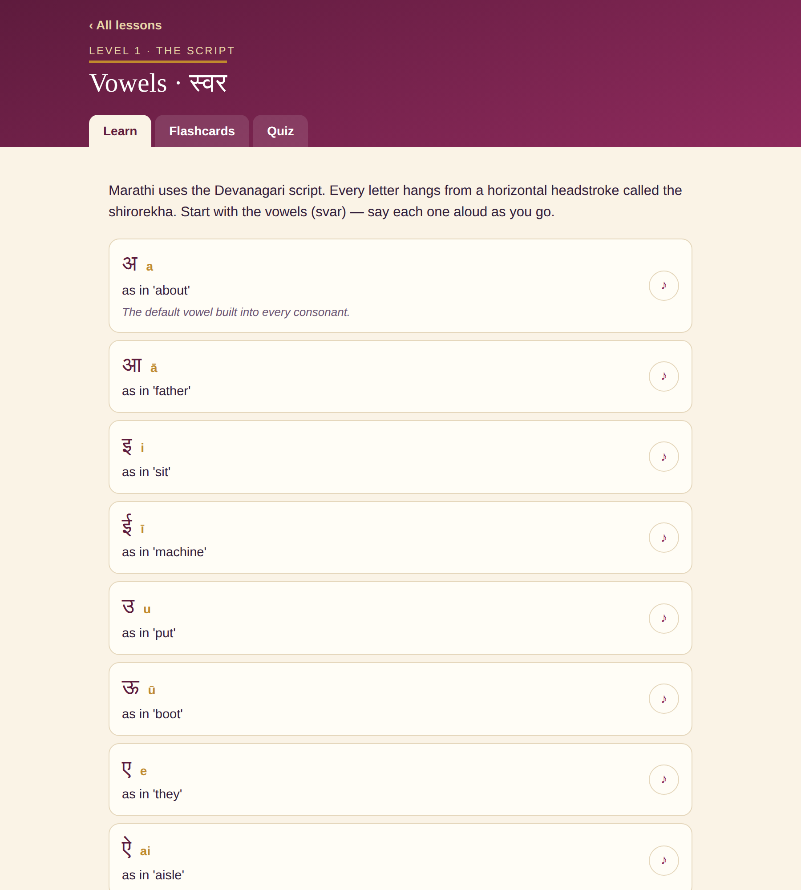
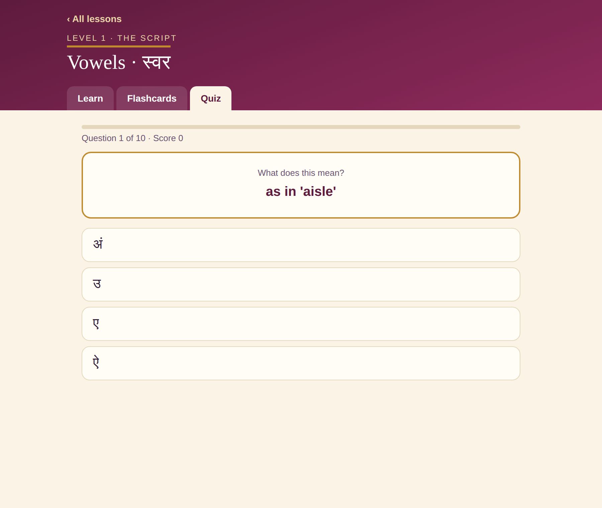

<div align="center">

# मराठी शिका · Learn Marathi

**A complete, self-contained web course for learning Marathi — from the Devanagari script to real conversation.**

[](https://extinctmushroom.github.io/Marathi/)
&nbsp;




</div>

---

Marathi is the language of ~83 million people — of Mumbai and Pune, of the saint-poets, of street-corner वडा पाव. Most learning resources treat it as an afterthought to Hindi. **मराठी शिका** is built for Marathi on its own terms: the retroflex ळ, the *dnya* of ज्ञ, the breathy म्ह/न्ह clusters, three grammatical genders, and the object-agreeing past tense that trips up every newcomer.

It runs entirely in the browser. No accounts, no backend, no tracking — progress lives in `localStorage` and never leaves your device.

## The curriculum

**7 levels · 43 lessons · 587 items**, sequenced so each lesson builds on the last:

| Level | Focus |
| --- | --- |
| **1 · लिपी The Script** | Vowels, consonants, vowel signs (*mātrā*), joined letters, reading practice, numbers |
| **2 · पाया Foundations** | Greetings, pronouns & "to be", question words, first sentences, essential verbs |
| **3 · व्याकरण Grammar** | Three genders, present/past/future tense, negation, commands, postpositions |
| **4 · शब्दसंपदा Vocabulary** | Family, food, body & health, animals & nature, around town, time, colors, big numbers |
| **5 · संभाषण Conversation** | The market, getting around, eating out, polite speech, small talk, emergencies |
| **6 · प्रगत Advanced** | Modals, compound verbs, conditionals, connectors, festivals & culture, proverbs |
| **7 · प्रभुत्व Mastery** | Conversational particles, idioms, real-world signs, and your first story in Marathi |

## How it teaches

Every lesson moves through three stages:

<div align="center">

&nbsp;&nbsp;

</div>

1. **Learn** — each item shows Devanagari, transliteration, meaning, a usage note, and tap-to-hear audio.
2. **Flashcards** — flip in either direction (Marathi → English or the reverse), shuffle, fully keyboard-driven.
3. **Quiz** — a mix of formats: multiple choice both ways, **listening** questions (hear it, pick what you heard), and **typing** questions where transliteration is matched diacritic-insensitively, so `pani` is accepted for `pāṇī`. Score 70%+ to complete the lesson.

Passing a quiz adds that lesson's words to a global **उजळणी review deck** backed by a lightweight spaced-repetition scheduler. Rate each card *Again / Hard / Good / Easy*; intervals grow so words resurface just before you'd forget them.

Rounding it out:

- 📲 **Installable and works offline** — add it to your home screen and the whole course runs without a connection, so a commute or a flight is fair game
- 🌗 **Light and dark themes** — follows your system by default, with a manual toggle that sticks
- 💾 **Back up & restore progress** — export everything to a JSON file and reload it on another device or after clearing site data (important, since there are no accounts)
- 🔥 **Daily streak** tracking to build the habit
- 🔍 **Course-wide search** by Marathi, transliteration, or English — effectively a built-in dictionary
- ▶ **Continue** button that always resumes at your next unfinished lesson
- ♪ **Text-to-speech** on every item, using the device's Marathi voice with a Hindi fallback
- ⌨️ **Keyboard shortcuts** throughout — space to flip, arrows to navigate, `1`–`4` to answer or grade
- 📱 Responsive and accessible (focus-visible states, `prefers-reduced-motion`, live-region toasts)

## Technical highlights

- **Data-driven core.** The entire course is plain data — one file per level, each item a `{ mr, tr, en, note? }` object. Every feature (flashcards, all three quiz formats, search, the review deck) is generated from it, so adding content never touches feature code.
- **Custom spaced-repetition scheduler** (`src/lib/srs.js`) — a compact SM-2-style algorithm with four grades and growing intervals, kept intentionally small and dependency-free.
- **Diacritic-insensitive matching** via Unicode NFD normalization, shared by both typed-answer grading and course search, so learners are never punished for skipping accent marks.
- **Zero runtime dependencies** beyond React itself — no UI kit, no state library. State and a tiny view router live in `App.jsx`; styling is a hand-written CSS design system.
- **Fails loudly, never blankly** — static boot markup, a `nomodule` notice, a stalled-load watchdog, and an error boundary, so a broken load explains itself instead of showing an empty page.
- **Offline via Workbox** (`vite-plugin-pwa`), precaching the shell and its content-hashed assets as one revisioned set. An earlier hand-rolled worker cached `index.html` independently, so after a deploy a stale shell could point at a bundle hash that no longer existed; the regression test now installs the worker, swaps a different build underneath it, and asserts the app still loads, updates, and works offline.
- **Themeable by design** — the palette is split into *role* tokens (`--accent-strong` for Devanagari text vs `--surface-deep` for headers), so dark mode lightens text without washing out the deep-plum surfaces the brand depends on.
- **Portable static build** (`base: "./"`) that runs from any host — GitHub Pages, Netlify, or a plain file server — deployed by a GitHub Actions workflow.

## Project structure

```
src/
  data/          one file per level — the entire curriculum as pure data
  lib/           speech (TTS), storage/backup, quiz builder, SRS scheduler, theme
  components/    Home, LessonView, Learn/Cards/Quiz tabs, ReviewView, shared UI
  App.jsx        state, view routing, and progress persistence
  styles.css     the CSS design system (paper / magenta / gold, light + dark)
public/          service worker, web manifest, icons, social card
scripts/         curriculum integrity check (npm run check)
```

## Getting started

```bash
npm install
npm run dev       # start the dev server
npm run check     # validate the curriculum data
npm run build     # production build → dist/
npm run preview   # serve the production build locally
```

Requires Node 18+.

Adding content is just editing a file in `src/data/` — then `npm run check` verifies the additions (no duplicate entries, nothing that would break quiz generation or collide in the review deck) before you ship.

> Note: the service worker is registered in production builds only, so `npm run dev` never serves you a stale bundle.

## Roadmap

- Handwriting practice for Devanagari (stroke-order tracing)
- Recorded native audio to replace synthesized speech
- Dialogue lessons with role-play
- Per-lesson recorded audio, cached for offline listening

## License

Released under the [MIT License](LICENSE) — use it, fork it, teach with it.

## Acknowledgements

Co-authored with **Claude** ([Anthropic](https://www.anthropic.com)) — a collaborator on the curriculum design, the spaced-repetition and quiz engines, and the interface. Every feature was tested end-to-end before release.
