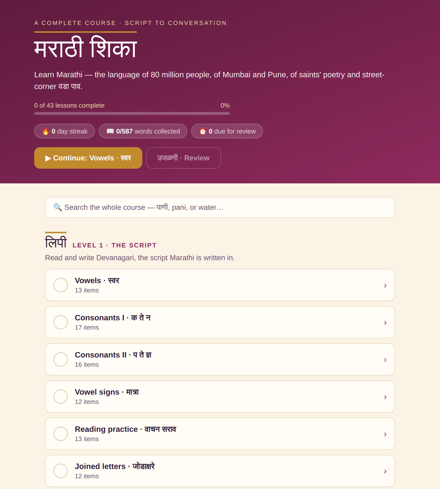
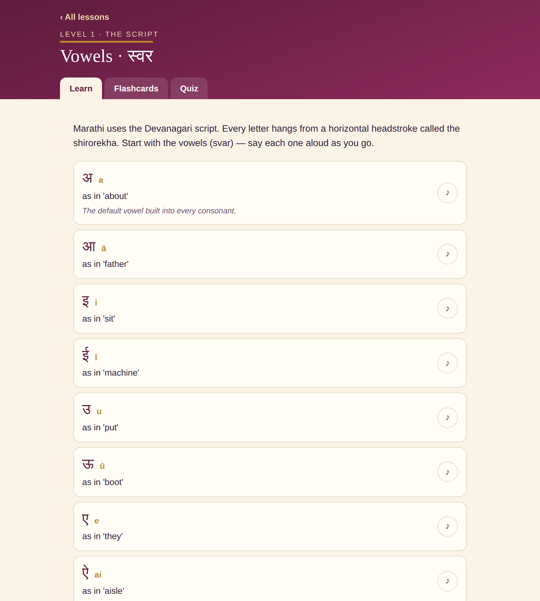
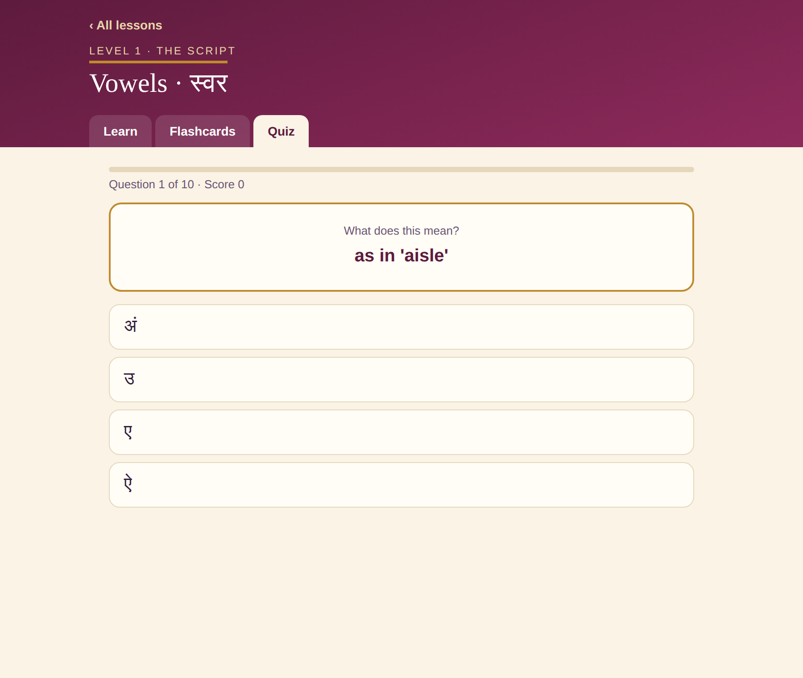

<div align="center">

# मराठी शिका · Learn Marathi

**A complete, self-contained web course for learning Marathi — from the Devanagari script to real conversation.**

[](https://extinctmushroom.github.io/Marathi/)
&nbsp;




</div>

---

Marathi is the language of ~83 million people — of Mumbai and Pune, of the saint-poets, of street-corner वडा पाव. Most learning resources treat it as an afterthought to Hindi. **मराठी शिका** is built for Marathi on its own terms: the retroflex ळ, the *dnya* of ज्ञ, the breathy म्ह/न्ह clusters, three grammatical genders, and the object-agreeing past tense that trips up every newcomer.

It runs entirely in the browser. No accounts, no backend, no tracking — progress lives in `localStorage` and never leaves your device.

## The curriculum

**7 levels · 43 lessons · 587 items**, sequenced so each lesson builds on the last:

| Level | Focus |
| --- | --- |
| **1 · लिपी The Script** | Vowels, consonants, vowel signs (*mātrā*), joined letters, reading practice, numbers |
| **2 · पाया Foundations** | Greetings, pronouns & "to be", question words, first sentences, essential verbs |
| **3 · व्याकरण Grammar** | Three genders, present/past/future tense, negation, commands, postpositions |
| **4 · शब्दसंपदा Vocabulary** | Family, food, body & health, animals & nature, around town, time, colors, big numbers |
| **5 · संभाषण Conversation** | The market, getting around, eating out, polite speech, small talk, emergencies |
| **6 · प्रगत Advanced** | Modals, compound verbs, conditionals, connectors, festivals & culture, proverbs |
| **7 · प्रभुत्व Mastery** | Conversational particles, idioms, real-world signs, and your first story in Marathi |

## How it teaches

Every lesson moves through three stages:

<div align="center">

&nbsp;&nbsp;

</div>

1. **Learn** — each item shows Devanagari, transliteration, meaning, a usage note, and tap-to-hear audio.
2. **Flashcards** — flip in either direction (Marathi → English or the reverse), shuffle, fully keyboard-driven.
3. **Quiz** — a mix of formats: multiple choice both ways, **listening** questions (hear it, pick what you heard), and **typing** questions where transliteration is matched diacritic-insensitively, so `pani` is accepted for `pāṇī`. Score 70%+ to complete the lesson.

Passing a quiz adds that lesson's words to a global **उजळणी review deck** backed by a lightweight spaced-repetition scheduler. Rate each card *Again / Hard / Good / Easy*; intervals grow so words resurface just before you'd forget them.

Rounding it out:

- 📲 **Installable and works offline** — add it to your home screen and the whole course runs without a connection, so a commute or a flight is fair game
- 🌗 **Light and dark themes** — follows your system by default, with a manual toggle that sticks
- 💾 **Back up & restore progress** — export everything to a JSON file and reload it on another device or after clearing site data (important, since there are no accounts)
- 🔥 **Daily streak** tracking to build the habit
- 🔍 **Course-wide search** by Marathi, transliteration, or English — effectively a built-in dictionary
- ▶ **Continue** button that always resumes at your next unfinished lesson
- ♪ **Text-to-speech** on every item — Marathi voice clips bundled with the app (a Google Cloud WaveNet voice, backed up by the open-source AI4Bharat Indic-TTS voice), no keys needed at runtime; the device's Marathi voice covers anything without a clip
- ⌨️ **Keyboard shortcuts** throughout — space to flip, arrows to navigate, `1`–`4` to answer or grade
- 📱 Responsive and accessible (focus-visible states, `prefers-reduced-motion`, live-region toasts)

## Technical highlights

- **Data-driven core.** The entire course is plain data — one file per level, each item a `{ mr, tr, en, note? }` object. Every feature (flashcards, all three quiz formats, search, the review deck) is generated from it, so adding content never touches feature code.
- **Custom spaced-repetition scheduler** (`src/lib/srs.js`) — a compact SM-2-style algorithm with four grades and growing intervals, kept intentionally small and dependency-free.
- **Diacritic-insensitive matching** via Unicode NFD normalization, shared by both typed-answer grading and course search, so learners are never punished for skipping accent marks.
- **Zero runtime dependencies** beyond React itself — no UI kit, no state library. State and a tiny view router live in `App.jsx`; styling is a hand-written CSS design system.
- **Fails loudly, never blankly** — static boot markup, a `nomodule` notice, a stalled-load watchdog, and an error boundary, so a broken load explains itself instead of showing an empty page.
- **Offline via Workbox** (`vite-plugin-pwa`), precaching the shell and its content-hashed assets as one revisioned set. An earlier hand-rolled worker cached `index.html` independently, so after a deploy a stale shell could point at a bundle hash that no longer existed; the regression test now installs the worker, swaps a different build underneath it, and asserts the app still loads, updates, and works offline.
- **Themeable by design** — the palette is split into *role* tokens (`--accent-strong` for Devanagari text vs `--surface-deep` for headers), so dark mode lightens text without washing out the deep-plum surfaces the brand depends on.
- **Portable static build** (`base: "./"`) that runs from any host — GitHub Pages, Netlify, or a plain file server — deployed by a GitHub Actions workflow.

## Project structure

```
src/
  data/          one file per level — the entire curriculum as pure data
  lib/           speech (TTS) and clip naming, storage/backup, quiz builder, SRS scheduler, theme
  components/    Home, LessonView, Learn/Cards/Quiz tabs, ReviewView, shared UI
  App.jsx        state, view routing, and progress persistence
  styles.css     the CSS design system (paper / magenta / gold, light + dark)
public/          web manifest, icons, social card, speech clips in audio/ (primary) and audio-backup/ (backup)
scripts/         curriculum integrity check (npm run check), speech clip generators (npm run audio: primary cloud voice; generate-audio-local.py: open-source backup)
```

## Getting started

```bash
npm install
npm run dev       # start the dev server
npm run check     # validate the curriculum data
npm run audio     # update the primary voice clips; needs a cloud key (see Audio voices)
npm run build     # production build → dist/
npm run preview   # serve the production build locally
```

Requires Node 18+.

Adding content is just editing a file in `src/data/` — then `npm run check` verifies the additions (no duplicate entries, nothing that would break quiz generation or collide in the review deck) before you ship.

> Note: the service worker is registered in production builds only, so `npm run dev` never serves you a stale bundle.

## Audio voices

The ♪ buttons play real Marathi speech that ships with the app: no account or API key is involved at runtime or when the site deploys. For each text the app uses the first of three tiers that has it:

1. **Primary: Google Cloud Text-to-Speech** (`mr-IN-Wavenet-A`, a female WaveNet voice, at 0.9× speed for learners), committed as `public/audio/<hash>.mp3` plus `public/audio/manifest.json`, about 5 MB for the whole course.
2. **Backup: AI4Bharat Indic-TTS**, an open-source model (FastPitch + HiFi-GAN, Marathi *female* speaker), committed as `public/audio-backup/<hash>.mp3` plus its own `manifest.json`, about 3.5 MB. It plays when a text has no primary clip, and also when a primary clip fails to load or play.
3. **The device's own Marathi voice** (Web Speech API, `mr-IN`) for anything with no clip in either set. The app never substitutes another language's voice; if the device has no Marathi voice, the browser is simply asked for `mr-IN`.

Both sets name a clip by a hash of its text (`src/lib/audioKey.js`), so the same file name means the same text in either folder. Each manifest records the voice its clips were made with, and that goes into the clip URL (`?v=…`), so a voice change is never masked by an old cached clip. The app loads both manifests in parallel at startup, and the service worker caches each clip the first time it is played, so clips you have heard work offline too.

`npm run check` warns about spoken items that have no clip in either set, and notes items that only one set covers.

### Regenerating the primary (Google) clips

The Google clips are committed, and **the deploy workflow never calls a cloud API**, so the key is only used when you start this manual workflow:

1. Make sure the `GOOGLE_TTS_API_KEY` secret is set under **Settings → Secrets and variables → Actions**, and that the Cloud Text-to-Speech API is enabled for the key's project (Google Cloud console → **APIs & Services → Enabled APIs & services → Cloud Text-to-Speech API**; enable it again if you disabled it after the last run).
2. Run **Actions → Generate voice clips → Run workflow** on the branch you deploy from. It runs `npm run audio`, which keeps every committed clip (same provider, voice and rate as `public/audio/manifest.json`) and synthesizes only new or edited text, commits `public/audio` to that branch as `github-actions[bot]`, and starts the deploy when that branch is `main`. Without credentials for the provider it uses, it fails immediately with an error saying so.
3. Disable the Cloud Text-to-Speech API for that project again (same page → **Disable API**) until the next text change. Nothing else needs it. (Google Cloud API keys themselves cannot be switched off; restricting the key to that API is a good extra safeguard.)

Run it only when the course text changes. To see what a run would do, with no network access or credentials (until the text changes it reports `to generate: 0`):

```bash
npm run audio -- --dry-run
```

`GOOGLE_TTS_API_KEY=… npm run audio` does the same locally in your working tree. With no credentials, `npm run audio` only prints a warning and never changes any file.

To use a different cloud voice instead, set these under **Settings → Secrets and variables → Actions** before running the workflow:

| Provider | Secrets | Variables | Default voice |
| --- | --- | --- | --- |
| Google Cloud Text-to-Speech | `GOOGLE_TTS_API_KEY` | | `mr-IN-Wavenet-A` |
| Azure Speech | `AZURE_SPEECH_KEY` | `AZURE_SPEECH_REGION` (e.g. `centralindia`) | `mr-IN-AarohiNeural` |

Optional variables: `TTS_PROVIDER` (`google` or `azure`; by default Google is used if its key is set, else Azure) and `TTS_VOICE` (e.g. `mr-IN-Wavenet-B` or `mr-IN-ManoharNeural` for a male voice). Leave both unset to keep the committed voice: any change of provider, voice or rate regenerates every primary clip. Google's higher-tier Chirp 3 HD voices work via `TTS_VOICE`, but they ignore speaking rate, so the slower learner pace is lost. If you switch, update the voice credit in the footer of `src/components/Home.jsx` too. Both providers have a monthly free tier at the time of writing (check current pricing), and the whole course is only a few thousand characters of text.

### Regenerating the backup (open-source) clips

No key needed: [`scripts/generate-audio-local.py`](scripts/generate-audio-local.py) runs the model on your own machine and writes `public/audio-backup` (pass `--out-dir` to write elsewhere). Set up the Python environment described at the top of that file once (Python 3.10, CPU-only PyTorch, Coqui `TTS`, and the 1.5 GB `mr.zip` checkpoint), then:

```bash
python scripts/generate-audio-local.py            # only the missing clips; commit public/audio-backup afterwards
python scripts/generate-audio-local.py --speaker male   # the male voice instead (regenerates everything)
python scripts/generate-audio-local.py --force    # redo every clip
```

After adding or editing lessons, run it too: the Generate voice clips workflow only updates `public/audio`, and `npm run check` says how many spoken items have no backup clip. It reads the clip list and file names from `node scripts/generate-audio.mjs --list`, so it never recomputes them. A full run takes about three minutes on four CPU cores. The script also trims silence, levels every clip to the same volume, spells digits as Marathi number words, and reports anything that looks wrong.

### Credits and licences

- **Primary voice:** synthesized with [Google Cloud Text-to-Speech](https://cloud.google.com/text-to-speech). Its output needs no attribution; the footer names it only so learners know what they are hearing.
- **Backup voice:** [AI4Bharat/Indic-TTS](https://github.com/AI4Bharat/Indic-TTS) (Gokul Karthik Kumar et al., *Towards Building Text-To-Speech Systems for the Next Billion Users*, ICASSP 2023). The repository's `LICENSE.txt` is the **MIT License, Copyright (c) 2023 AI4Bhārat**, and its model metadata (`inference/triton_server/ulca_models/indo-aryan.json`) lists the Marathi models as MIT too. They were trained on the Indic TTS database built by IIT Madras's SMT Lab. The backup clips are credited in the app's footer and in `public/audio-backup/manifest.json`; if you redistribute them commercially, check the current terms of the checkpoints and that database yourself.

## Roadmap

- Handwriting practice for Devanagari (stroke-order tracing)
- Recorded native audio to replace synthesized speech
- Dialogue lessons with role-play
- Per-lesson recorded audio, cached for offline listening

## License

Released under the [MIT License](LICENSE) — use it, fork it, teach with it.

## Acknowledgements

Co-authored with **Claude** ([Anthropic](https://www.anthropic.com)) — a collaborator on the curriculum design, the spaced-repetition and quiz engines, and the interface. Every feature was tested end-to-end before release.
